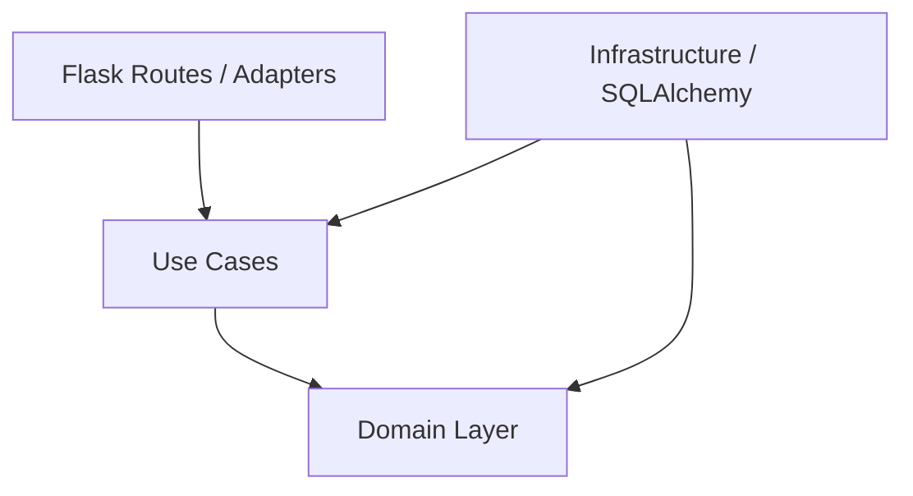

# アーキテクチャと設計原則 (Flask Clean Architecture Guide)

## 1. Clean Code 開発原則 (Clean Code Principles)

### 意図が明確な命名
- 変数・関数・クラス名は、それがなぜ存在するのか、何をするのか、どう使われるのかが伝わるように命名する。
- 暗号的な略称や、文脈がなければ意味を説明できない短縮名を使用しない（例: `usr_cnt` ではなく `user_count`）。

### 単一機能の関数と抽象化レベル (SLAP)
- 関数は短く保ち、1つのことだけを行う。
- 関数内の抽象化レベルを統一する（SLAP: Single Level of Abstraction Principle）。
- 副作用を持つ処理（I/O、DB操作、外部API呼び出し）と純粋な計算処理（ビジネスロジック）を分離する。

### 副作用の制御
- 関数宣言や名前から予期できない隠れた状態変化（グローバル変数の更新や引数オブジェクトの破壊的変更）を発生させない。
- 状態を変更する処理は責務と境界を明確にし、呼び出し側から挙動が把握できるようにする。

### マジックナンバー・文字列の排除
- 数値や制御文字列の直書きを禁止する。
- 必ず意図の伝わる名前付き定数や Enum へ抽出する（例: `src/constants.py` やドメイン列挙型）。

---

## 2. リファクタリング & 設計原則 (Refactoring & Design)

### コードの匂い（Code Smells）の排除
- **Long Function / Large Class**: 関数やクラスが肥大化した場合は、直ちに Extract Function / Extract Class で責務を分割する。
- **Feature Envy（機能の羨望）**: 他のオブジェクトのデータを主に使用している関数は、そのデータを持つ適切なモジュール/クラスへ Move Function する。
- **Primitive Obsession（基本型への執着）**: 識別子やドメイン上の意味を持つ値（例: `MoleculeId`, `Purity`）は、基本型（`str`, `float`）のまま回さず Value Object や Dataclass でカプセル化する。
- **Data Clumps（データの群れ）**: 常にセットで渡される引数群は、Dataclass や Struct へまとめる。

### リファクタリングの基本動作
- **Green-to-Green（緑から緑へ）**: 既存のテストがすべて合格（Pass）している状態を確認してから着手し、外部から見た振る舞いを変えずに内部構造だけを改善する。
- **Composed Method（構成されたメソッド）**: 上位の処理フローは、同じ抽象化レベルにある小さな関数呼び出しの組み合わせで構成する。

### アプリケーション設計原則
- **CQS (Command Query Separation)**:
  - **Command**: システムの状態を変更する操作（ビジネスロジックの実行等）。
  - **Query**: 状態を変更せず、データを取得・計算して返す操作。
  - 両者の責務を明確に分離し、Query 操作で副作用が発生しないようにする。
- **YAGNI (You Aren't Gonna Need It)**: 現在の要件にない将来の拡張性のためのオーバーエンジニアリングを避け、最善かつ最もシンプルな実装を選択する。
- **ユビキタス言語の反映**: 変数名・関数名・クラス名には、ドメイン（調合、元素、純度、患者等）の合意された語彙を正確に使用する。

---

## 3. アーキテクチャ記述方式 (Architecture Description Standard)

システムの構造と設計意図を明確にし、人間と AI エージェント間で解釈の差を発生させないため、以下の記述標準（C4 Model 準拠）を採用する。

### 3.1. C4 Model による構造記述
アーキテクチャの文書化（`docs/architecture/` 内）には以下を適用する：
- **Context Diagram (システムコンテキスト文脈)**: ユーザー（プレイヤー）、システム外部（外部API、ローカルストレージ）との関係。
- **Container Diagram (コンテナ構成)**: Flask Webサーバー、フロントエンドUI、データベース（SQLite/PostgreSQL）の物理・論理的配置。
- **Component Diagram (コンポーネント構成)**: 各レイヤー（Domain, UseCase, Adapter, Infrastructure）内部のモジュール構造と依存関係。

### 3.2. C4-PlantUML / Mermaid によるコード化 (Diagrams as Code)
図表はバイナリ画像ではなく、リポジトリ内でバージョン管理可能な **Mermaid** または **PlantUML** テキスト形式で記述する。



---

## 4. Clean Architecture & Flask レイヤー設計原則

### 4.1. レイヤー構造と依存方向のルール
システムは以下の層で構成され、依存の方向は必ず外側から内側（Domain）に向かわなければならない。

- **Domain Layer (コア領域 / `src/domain/`)**:
  - エンティティ、値オブジェクト（Value Object）、ドメインサービス。
  - **ルール**: 他のいかなる層（Flask、SQLAlchemy、外部API等）にも依存してはならない。純粋な Python コード（標準ライブラリのみ）で記述する。
- **Use Case Layer (応用層 / `src/usecases/`)**:
  - アプリケーション固有のユースケース（ビジネスフローの組み立て）。
  - **ルール**: Domain 層のみに依存する。DBや外部サービスへのアクセスは抽象（Interface/Protocol）を介して行う。
- **Interface / Adapter Layer (`src/adapters/` & `src/routes/`)**:
  - Flask の Route（Blueprint）、リクエスト/レスポンスのスキーマ（Pydantic等）、リポジトリの具象インターフェース。
  - **ルール**: Use Case 層を呼び出し、HTTPとドメインモデルの変換を行う。
- **Infrastructure Layer (`src/infrastructure/`)**:
  - データベース（SQLAlchemy）、外部APIクライアント、ファイルI/Oの具体実装。

### 4.2. 境界の保護と依存性逆転 (DIP)
- **Flask 依存の隔離**: `flask.request` や `jsonify` などの Web フレームワーク依存処理は、Route / Controller 層（最外層）の中に閉じ込め、Use Case や Domain 層へ侵入させない。
- **DB / ORマッパーの隔離**: SQLAlchemy の Model オブジェクトを直接ドメインロジック内で操作しない。リポジトリパターン（Repository Pattern）を挟み、Domain エンティティに変換して扱う。

---

## 5. 適合度関数による自動検証 (Fitness Functions)

「進化的アーキテクチャ（Evolutionary Architecture）」の原則に基づき、アーキテクチャの境界保護やコード品質を人間のレビューに頼らず**自動テスト・静的解析（Fitness Functions）**でガードレールとして運用する。

### 5.1. 依存方向の自動検証 (Architectural Fitness Functions)
- **Import 境界テスト (pytest + import-linter)**:
  - CI パイプライン上で `import-linter` を実行する。
  - `src/domain/` 内のコードが `flask`, `sqlalchemy`, `src.adapters`, `src.infrastructure` をインポートしている場合、ビルドを強制失敗（Fail）させる。

```ini
# .importlinter の設定例
[importlinter]
root_package = src

[importlinter:contract:domain-isolation]
name = Domain layer must not import external layers
type = forbidden
forbidden_modules =
    flask
    sqlalchemy
    src.adapters
    src.infrastructure
layers =
    src.domain
```

### 5.2. コード品質とカバレッジの適合度検証 (Quality & Coverage Fitness Functions)

カバレッジ数値の「見せかけの達成」を防ぐため、**レイヤー別にカバレッジ閾値を分離定義し、`pytest-cov` で自動計測・ガードレール化**する。

| レイヤー | 測定対象 | ブランチカバレッジ目標 | 理由・運用方針 |
| :--- | :--- | :--- | :--- |
| **Domain Layer** (`src/domain/`) | 純粋ロジック・純度計算・値オブジェクト | **95% 以上** | システムの核であり、外部依存を持たないため高カバレッジを維持しやすい。 |
| **Use Case Layer** (`src/usecases/`) | アプリケーションフロー・ドメイン連携 | **85% 以上** | ソーシャル単体テスト / 統合テストにより、条件分岐（Branch Coverage）を中心に検証。 |
| **Adapter / Route** (`src/routes/`) | Flask HTTPリクエスト/レスポンス変換 | **70% 以上** | 正常系・主要エラー系の変換ロジックをカバー。 |
| **Infrastructure** (`src/infrastructure/`) | DBリポジトリ・外部APIクライアント | **70% 以上** | 永続化統合テスト / ゲートウェイ統合テストで実挙動をカバー。 |

#### カバレッジ適合度関数の CI 設定ルール
CI 上で以下のコマンドを実行し、規定の閾値を下回った場合は PR のビルドを失敗（Fail）させる：

```bash
# ドメイン層のブランチカバレッジ95%未満で自動Fail
pytest --cov=src/domain --cov-branch --cov-fail-under=95 tests/unit/domain

# 全体のブランチカバレッジ80%未満で自動Fail
pytest --cov=src --cov-branch --cov-fail-under=80 tests/
```

- **C1 (Branch Coverage) の優先**: 単なる行網羅（Line Coverage）ではなく、分岐網羅（Branch Coverage）を検証対象とし、条件分岐のテスト漏れを防止する。
- **リファクタリング時の耐性**: 内部のプライベート関数追加によってカバレッジが低下しないよう、公開インターフェース（観測可能な振る舞い）経由のテストでカバレッジを維持する。

### 5.3. 静的コード品質の適合度検証 (Static Quality Fitness Functions)
- **型安全率 (mypy)**:
  - Domain 層および Use Case 層では `mypy --strict` を全件 Pass させる。
- **巡回複雑度 (Cyclomatic Complexity - radon / flake8)**:
  - 1つの関数の巡回複雑度は **10以下** に維持する。10を超える関数が存在する場合、CI 段階でエラーとする。
- **レイヤー間モジュール結合度**:
  - `src/domain` からサードパーティ製ライブラリへの過剰な結合を検知し、標準ライブラリ中心の純粋性を保護する。

---

## 6. アーキテクチャ決定記録 (Architecture Decision Records: ADR)

重要な意思決定（アーキテクチャスタイルの選定、フレームワークやライブラリの採用・改変など）は、すべて ADR（Architecture Decision Record）として文書化し、リポジトリ (`docs/adr/`) 内でコードとともにバージョン管理する。

### 6.1. ADR 運用ルール
- **履歴の改ざん禁止**: 過去の決定事項を直接書き換えず、仕様変更時は新たな ADR を作成して古い ADR を Superseded に更新する。
- **AI エージェントへの制約提示**: AI エージェントは過去の ADR と矛盾するコード生成やライブラリ追加を行ってはならない。

### 6.2. ADR 標準フォーマット (`docs/adr/NNNN-title.md`)

```markdown
# [ADR-NNNN] [決定事項のタイトルの簡潔な記述]

* **ステータス**: [提案中 (Proposed) | 承認 (Accepted) | 廃止 (Deprecated) | 置換 (Superseded by ADR-XXXX)]
* **決定者**: [開発者名 / チーム名]
* **日付**: YYYY-MM-DD

## 1. 文脈と問題提起 (Context & Problem Statement)
[どのような問題が発生したか、またはどのような新機能・変更が必要になったのかの背景]

## 2. 検討した選択肢 (Considered Options)
* **選択肢 A**: [概要とメリット・デメリット]
* **選択肢 B**: [概要とメリット・デメリット]

## 3. 決定と根拠 (Decision Outcome & Rationale)
[どの選択肢を選んだかと、その主たる理由。トレードオフを明記]

## 4. 評価と結果 (Consequences)
### 正の影響 (Positive Consequences)
* [得られるメリット]
### 負の影響 / リスク (Negative Consequences / Risks)
* [新たに生じる制約、運用コストなど]

## 5. 適合度関数 / 検証基準 (Fitness Functions & Validation)
* [この決定が守られているかを自動検証する方法（例: 自動テスト、import-linter等）]
```

---

## 7. 増分変更と CI ガバナンス (Governance)

- **増分変更 (Incremental Change)**: 機能変更やリファクタリングは小さなコミット単位に分け、互換性を保ちながら実装と自動テストを繰り返す。
- **CI 品質ゲート (Quality Gate)**: PR 作成時、単体テスト・結合テストの全件 Pass に加え、上記の適合度関数（Fitness Functions）の検証を自動パスすることを必須とする。
