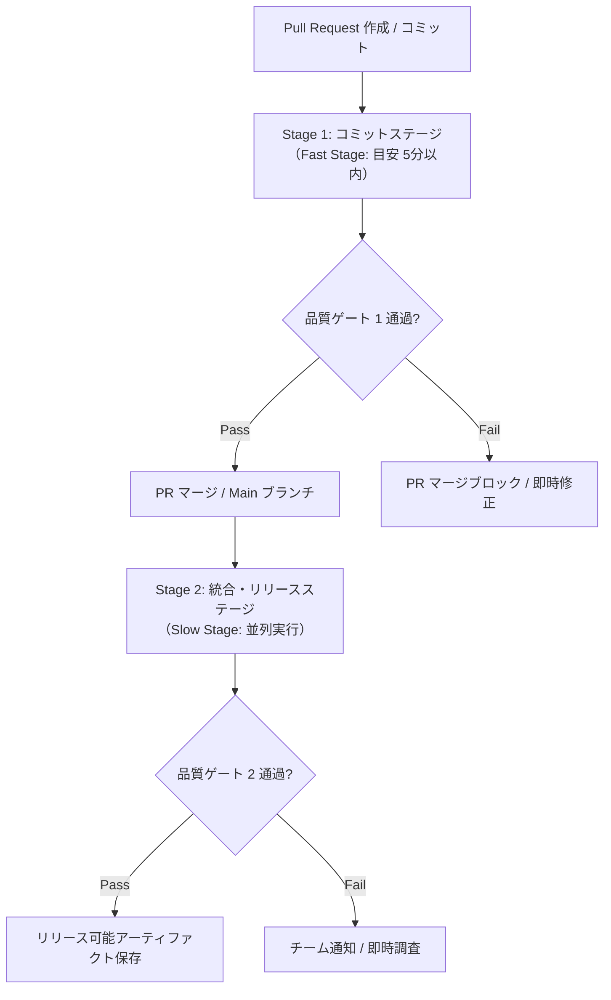

# CI 戦略 (Continuous Integration Strategy)

## 1. 目的と基本方針

本プロジェクトでは、書籍『継続的デリバリー』の原則に従い、CI（継続的インテグレーション）を**「品質を保証する自動制御装置」**として運用する。コードの変更に対し、極めて短いフィードバックループで自動検証を行い、常に本番リリース可能な状態（Release Readiness）を維持する。

- **変更の頻繁な統合**: 変更を小さく保ち、頻繁にメインラインへ統合してマージコンフリクトと不確実性を最小化する。
- **全自動化された品質ゲート**: 型チェック・静的解析・各レベルの自動テスト・要件追跡性の確認を自動実行し、基準を満たさない変更は機械的にブロックする。
- **環境パリティ（再現性）**: 開発環境、CI 環境、検証環境の差異を最小化し、ローカルでの再現性を担保する。

---

## 2. 継続的デリバリーの原則

### 2.1. 高速なフィードバックループ
- 開発者がコミット・PR 作成を行ってから **5〜10 分以内** に成否の一次判定を返す。
- 失敗理由が即座に切り分けられるよう、CI ログとテストレポートを明確に出力する。

### 2.2. 品質を組み込む（Built-in Quality）
- 人手によるチェックに頼らず、型安全・スタイル・アーキテクチャ境界（Fitness Functions）・テストカバレッジを CI パイプライン内で機械的に判定する。

### 2.3. ビルドの不変性 (Build Once, Deploy Many)
- ビルド生成物（Docker イメージやパッケージ）は CI 上で一度だけビルド・テストし、同一のバイナリ成果物を各検証・デプロイ環境へ昇格（Promote）させる。

---

## 3. 段階的パイプライン設計 (Staged Pipeline)

パイプラインの実行速度と検証の網羅性を両立するため、パイプラインを **2 つのフェーズ（コミットステージ / 統合ステージ）** に分離して運用する。

### 3.1. Stage 1: コミットステージ (Fast Stage / 目安 5分以内)
PR 作成時およびコミットごとに同期実行され、マージをブロックする必須ゲート。
1. **静的解析・型チェック**:
   - `mypy --strict` による型検証
   - `ruff` / `flake8` によるコード静的解析
   - `import-linter` によるドメイン層の境界保護（Fitness Functions）
2. **Fast Tests（高速テスト）**:
   - ソロ単体テスト / ソーシャル単体テスト
   - インプロセスコンポーネントテスト
   - 受け入れテスト（API / ユースケース層経由の Given-When-Then シナリオ）
3. **要件追跡性チェック**:
   - 定義された要求 ID (`REQ-xxx`) に対し、受け入れテストの紐付けが存在するか検証。
4. **ドキュメント構文検証**:
   - Markdown lint、リンク切れ検証。

### 3.2. Stage 2: 統合・リリースステージ (Slow / Integration Stage)
PR マージ後または nightly / 手動トリガーで並列実行される高負荷検証。
1. **Slow Tests（統合・貫通テスト）**:
   - アウトプロセスコンポーネントテスト（Testcontainers / 本物 DB 接続）
   - 永続化統合テスト / ゲートウェイ統合テスト
   - E2E テスト（クリティカルパスの貫通テスト）
2. **非機能・性能ベンチマーク**:
   - レイテンシ目標（`NFR-PERF-01` 等）の自動計測。
3. **セキュリティスキャン**:
   - 依存パッケージの脆弱性検査（`pip-audit` / `trivy`）
   - 機密情報・シークレット漏洩スキャン（`gitleaks`）
4. **アーティファクトビルド**:
   - デプロイ用 Docker イメージのビルドとタグ付け。

---

## 4. パイプライン品質ゲートの合否判定基準

以下のいずれかに該当する場合、CI は即座に **Fail（ビルド失敗）** と判定し、マージを許可しない。

- [ ] 型チェック (`mypy`) または静的解析で 1 件以上のエラーがある。
- [ ] アーキテクチャ境界テスト（ドメイン層への禁止インポート）に違反している。
- [ ] いずれかの自動テストが失敗している。
- [ ] 要求カバレッジにおいて、未カバーの要求 ID (`REQ-xxx`) が存在する。
- [ ] ドメイン層のブランチカバレッジが 95% 未満、または全体が 80% 未満である。
- [ ] シークレットスキャンで API キー等の平文混入が検知された。

---

## 5. キャッシュ戦略と高速化

CI の実行時間を短縮し、開発者の待ち時間を最小化するために以下を適用する。

- **依存パッケージのキャッシュ**:
  - `actions/cache` を用い、`pip` / `poetry` / `npm` のキャッシュディレクトリをロックファイル（`requirements.txt` / `poetry.lock`）のハッシュ値キーで永続化。
- **テストの並列実行**:
  - `pytest-xdist` (`pytest -n auto`) による単体テストのマルチプロセス並列実行。
- **Docker レイヤーキャッシュ**:
  - GitHub Actions Cache (`type=gha`) またはレジストリキャッシュを活用したコンテナビルドの高速化。

---

## 6. デリバリーパフォーマンスと 4 Keys の測定 (DORA 4 Keys)

『LeanとDevOpsの科学（Accelerate）』に基づき、開発プロセスの健全性と組織デリバリーパフォーマンスを測定するため、**4 Keys (DORA Metrics)** を自動収集・追跡する。

| 指標 (Metric) | 定義 | 当プロジェクトの目標水準 (Elite / High) |
| :--- | :--- | :--- |
| **1. デプロイ頻度** *(Deployment Frequency - DF)* | 本番環境（または主要検証環境）へのリリース頻度。 | **1日数回〜週数回**（小さなバッチでの継続的リリース） |
| **2. 変更のリードタイム** *(Lead Time for Changes - LT)* | コミットが作成されてから本番稼働するまでの所要時間。 | **1時間未満〜1日以内**（PR作成からマージ・デプロイまで） |
| **3. 変更障害率** *(Change Failure Rate - CFR)* | 本番リリース後にロールバックやホットフィックスが必要になった割合。 | **0% 〜 15% 未満** |
| **4. サービス復旧時間** *(Time to Restore Service - TTRS)* | 本番インシデント発生からサービスが正常復旧するまでの時間。 | **1時間未満**（即時 rollback または自動修復） |

### 6.1. 4 Keys の自動計測アーキテクチャ
CI/CD パイプライン内で以下のイベントログを自動抽出し、メトリクス化する。
1. **コミット・PR イベント**: PR オープン日時、最初のコミット日時、マージ日時から「変更のリードタイム」を算出。
2. **デプロイワークフロー**: デプロイ成功イベントから「デプロイ頻度」をカウント。
3. **ホットフィックス・ロールバック検出**: `fix:` コミットの直後リリースや revert 操作から「変更障害率」「復旧時間」を算出。
4. **メトリクス蓄積**: 抽出データは `metrics/dora-latest.json` として出力し、動的品質ダッシュボードと連携して週次・月次の推移グラフを描画する。

---

## 7. 実務ルールと運用

- **CI First 原則**: ローカルでテストが成功しても、CI の結果が Green になるまで作業完了とみなさない。
- **Broken Window（割れ窓）の即時修復**:
  - メインブランチの CI が失敗した場合、全開発作業に優先してパイプラインの修正または直前コミットのロールバックを行う。
- **再現手順の共通化**:
  - CI で実行するコマンドはすべてローカル環境（`Makefile` またはスクリプト）で 1 コマンドで再現可能にする（例: `make test`, `make lint`）。
