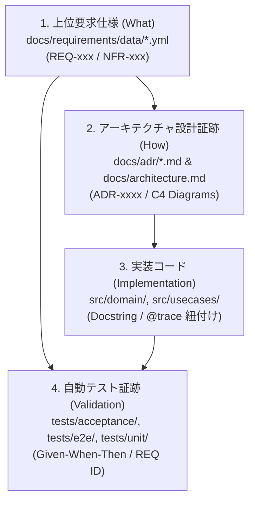

# ドキュメント品質運用ガイド (Documentation Quality Guide)

## 1. 目的

このリポジトリでは、プロジェクトの要求事項、アーキテクチャ設計証跡、実装ソースコード、自動テストを ISO/IEC 29148（要求工学）および ISO/IEC 25010（システム・ソフトウェア製品品質）の品質期待値と整合させるため、**「文書・トレーサビリティをコードとして扱う (Docs & Traceability as Code)」** 運用を採用する。

---

## 2. 品質目標と垂直トレーサビリティ (Vertical Traceability)

上位ドキュメントから下位コードまでの断絶（孤立コード・未追跡要件）を排除するため、以下の垂直トレーサビリティチェーン（Vertical Traceability Chain）を機械的に保護する。



- **双方向追跡性 (Bidirectional Traceability)**: すべての要求は設計・コード・テストへ追跡可能（順方向）であり、すべての実装コードは由来する要求 ID と設計 ADR へ逆方向追跡可能であること。
- **孤立要素の完全排除**:
  - 親要件のないコード実装（スコープ外コード / Gold Plating）の禁止。
  - テストの存在しない要求仕様（未検証要件）の禁止。
- **一貫性と完全性**: 要求 ID、タイトル、親子関係が一意であり、未解決プレースホルダーや壊れた参照がないこと。

---

## 3. 必須の真実情報源 (Single Source of Truth)

- **要求データ**: `docs/requirements/data/*.yml`
- **人間が読む要求要約**: `docs/requirements.md`
- **アーキテクチャ決定記録 (ADR)**: `docs/adr/NNNN-*.md`
- **アーキテクチャ設計図**: `docs/architecture.md` (C4 Mermaid)
- **テスト戦略**: `docs/test-strategy.md`
- **トレーサビリティ検証・出力**: `scripts/validate_traceability.py`, `scripts/generate_traceability.py`
- **CI 検証**: `.github/workflows/docs-ci.yml`

---

## 4. コードとドキュメントの紐付け規約

実装コードおよびテストコードは、機械的解析スクリプトが AST で抽出できるよう、以下のルールで要求 ID を明記する。

### 4.1. 実装コード (`src/`) での紐付け
ドメインエンティティやユースケースの公開クラス・関数には、docstring 内に該当する要求 ID を記載する。

```python
class PurityCalculator:
    """[REQ-CHEM-01] [ADR-0002]
    適正温度と触媒条件に基づいてアスピリンの精製純度を計算するドメインサービス。
    """
    def calculate_purity(self, temp_celsius: float, catalyst_drops: int) -> float:
        ...
```

### 4.2. テストコード (`tests/`) での紐付け
受け入れテスト・E2E テストのテスト名または pytest マーカーに要求 ID を付与する。

```python
@pytest.mark.req("REQ-CHEM-01")
def test_aspirin_purification_at_optimal_temperature():
    """[REQ-CHEM-01] 適正温度で加熱した場合、純度99.9%のアスピリンが生成される"""
    ...
```

---

## 5. 運用手順と検証コマンド

1. `docs/requirements/data` 配下に YAML 形式で要求データを定義する。
2. 実例マッピングを経て ADR および実装コード・受け入れテストを作成する。
3. 実装コードおよびテストに要求 ID (`REQ-xxx`) を付与する。
4. PR 提出前に、ローカルで垂直トレーサビリティおよびドキュメント検証を実行する。

```bash
# 垂直トレーサビリティ（要求→設計→コード→テスト）の整合性検査
python3 scripts/validate_traceability.py

# トレーサビリティ DAG 図（Mermaid）の再生成
python3 scripts/generate_traceability.py

# MkDocs ポータルビルドの厳格検査
mkdocs build --strict
```

---

## 6. 品質スコアカード (Quality Scorecard)

CI パイプラインおよび PR 品質ゲートでは、以下の 100% 準拠を検証する。

- **要求 ID の一意性**: 100%
- **要求からテストへの追跡充足率**: 100% (全要求に最低1件の受け入れテストが存在)
- **要求からコードへの追跡充足率**: 100% (全機能要求に対応する実装モジュールが存在)
- **ドキュメント内リンク切れ**: 0 件
- **Markdown lint 違反**: 0 件

---

## 7. 実務ルール

- **要件・設計・コード・テストのセット更新**: 要求仕様を変更した場合、対応する ADR、実装コード、受け入れテストを同一 PR 内で不可分（アトミック）に更新する。
- **動的品質ダッシュボードとの連携**: 検証結果は `quality-dashboard` へ連携され、垂直トレーサビリティ DAG および充足率が時系列で可視化される。
