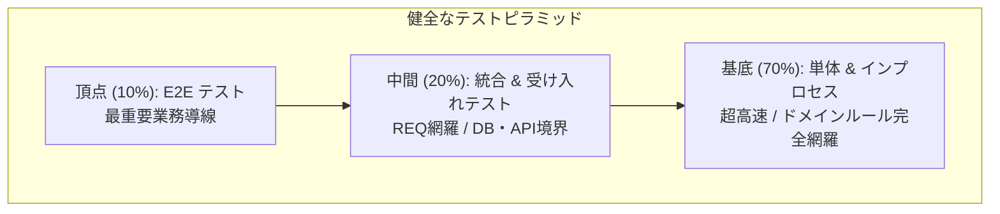
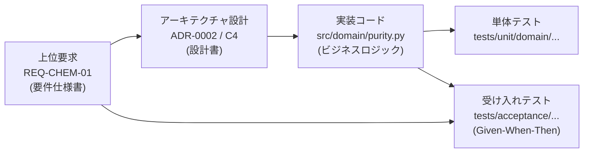

# 動的品質ダッシュボード運用ガイド (Dynamic Quality Dashboard)

## 1. 目的と基本方針

本プロジェクトでは、品質を単一コミットや特定 PR における「点」の静的判定にとどめず、**時系列推移（トレンド）として動的に可視化・追跡する動的品質ダッシュボード**を構築・運用する。

- **推移の可視化 (Trend Visibility)**: カバレッジの段階的低下、テストピラミッドの歪み、特定モジュールへのバグ集中、テスト実行時間の肥大化を早期に察知する。
- **データ駆動の意思決定 (Data-Driven Decisions)**: 開発チームおよび AI エージェントが品質傾向を客観的に把握し、リファクタリングやテスト強化の優先順位を的確に判断できるようにする。
- **完全自動化 (Zero-Touch Updates)**: CI パイプライン実行ごとに自動でメトリクスを収集・集計し、ダッシュボードを継続更新する。

---

## 2. 監視対象の主要メトリクス群 (Core Metrics Categories)

ダッシュボードでは、以下の 7 領域の時系列データおよび構造メトリクスを追跡する。

| カテゴリ | 監視指標 (Metrics) | 収集元 | 健全性の目標値・トレンド判定 |
| :--- | :--- | :--- | :--- |
| **1. テストピラミッド状態**<br>*(Pyramid Balance)* | - レベル別テスト比率<br>(Base 70% / Middle 20% / Top 10%)<br>- ピラミッド健全性指数 | `pytest --collect-only`<br>テストレベル別集計 | - 理想比率の維持<br>- **アイスクリームコーン・砂時計アンチパターンの排除** |
| **2. 垂直トレーサビリティ**<br>*(Vertical Traceability)* | - 要求 (REQ) → 設計 (ADR/C4) → 実装コード → テスト の紐付け充足率 (%)<br>- 孤立ノード（未追跡要素）数 | `validate_traceability.py`<br>AST / コメント解析 | - 垂直充足率 100%<br>- 要求・設計の未追跡コード 0 件 |
| **3. テスト密度・バグ密度**<br>*(Density Metrics)* | - **テスト密度**: テスト数 / KLOC<br>- **バグ密度**: 既知・修正バグ数 / KLOC<br>- モジュール別リスク偏り | Git 履歴 (`fix:` コミット)<br>`cloc` / `pytest` カウント | - テスト密度: 全モジュールで均一以上<br>- バグ密度: 0件/KLOC収束（特定モジュールへの集中是正） |
| **4. カバレッジ推移**<br>*(Coverage Trend)* | - レイヤー別ブランチカバレッジ (%)<br>(Domain, UseCase, Adapters, Infra)<br>- システム全体カバレッジ (%) | `pytest-cov`<br>(coverage.json) | - Domain 95%+, UseCase 85%+<br>- **過去7日間で下降トレンドがないこと** |
| **5. テスト健全性**<br>*(Test Health)* | - テスト総数・Pass率 (%)<br>- ステージ別実行時間 (秒)<br>- Flaky テスト発生件数 | `pytest --junitxml`<br>CI 実行時間ログ | - Pass 率 100%<br>- コミットステージ 5 分以内<br>- Flaky テスト 0 件 |
| **6. 静的解析・負債**<br>*(Code Quality)* | - 型安全率 / mypy エラー数<br>- 平均・最大巡回複雑度<br>- インポート境界違反数 | `mypy`, `radon`<br>`import-linter` | - 違反 0 件<br>- 最大複雑度 10 以下を維持 |
| **7. DORA 4 Keys**<br>*(Delivery Metrics)* | - デプロイ頻度 (DF)<br>- 変更リードタイム (LT)<br>- 変更障害率 (CFR)<br>- サービス復旧時間 (TTRS) | Git 履歴 / GitHub API<br>リリースログ | - 高速デリバリー水準（Elite / High）の維持 |

---

## 3. 重要可視化ビューの仕様 (Key Visualization Views)

### 3.1. テストピラミッド状態ビュー (Pyramid Status)
テストの構成比率をファンネル／積み上げグラフとして可視化し、アーキテクチャの劣化を監視する。



- **アイスクリームコーン警告**: E2E テストの比率が 20% を超え、単体テストの比率が 50% を下回った場合に警告。
- **砂時計型警告**: 中間の受け入れテスト・統合テストが極端に少なく、単体と E2E の両極端に二極化している場合に警告。

### 3.2. 垂直トレーサビリティ DAG ビュー (Vertical Traceability View)
上位ドキュメントからコード・テストへのリンク状態を有向非巡回グラフ（DAG）で可視化する。



- **孤立要素のハイライト**:
  - 親の要求 ID (`REQ-xxx`) を持たない実装コード（要件外実装）。
  - 自動テストが存在しない要求（テスト未充足要求）。
  - ADR のないアーキテクチャ変更。

### 3.3. テスト密度 × バグ密度 クアドラントビュー (Density Quadrant)
モジュールごとのコード行数（KLOC = 1,000 行）に対する「テスト密度」と「バグ密度」を散布図（4象限）にマッピングする。

```text
  バグ密度 (高)
      ▲
      │  [要リファクタリング・重点監視]    │  [複雑モジュール]
      │  テスト密度低 ＆ バグ密度高        │  テスト密度高 ＆ バグ密度高
      │  (最も危険な領域)                 │  (テストで防衛できているが複雑)
      ├─────────────────────────────────┼─────────────────────────────────► テスト密度 (高)
      │  [安定・健全領域]                │  [模範モジュール]
      │  テスト密度低 ＆ バグ密度低        │  テスト密度高 ＆ バグ密度低
      │  (単純な定数やスキーマ等)          │  (高品質・ドメインコア)
      │
```

- **アクション方針**:
  - 左上象限（テスト密度低 ＆ バグ密度高）に位置するモジュールは、最優先で単体テストの拡充およびリファクタリング対象に指定する。

---

## 4. ダッシュボードの構築アーキテクチャ (Architecture & Data Flow)

ダッシュボードは、重厚な外部サーバーを必要とせず、リポジトリ完結型（Git-backed Dynamic Portal）または軽量な静的サイト生成（GitHub Pages / MkDocs）で構築する。

```mermaid
flowchart LR
    subgraph CI Pipeline [GitHub Actions CI]
        Test[pytest & pytest-cov]
        Static[mypy & import-linter]
        Req[Traceability & AST Parser]
        Density[cloc & git log bug parser]
        DORA[Git Log / DORA Parser]
    end

    subgraph Data Layer [Metrics Store]
        Collector[scripts/collect_metrics.py]
        JSON[docs/metrics/history.json\n時系列スナップショット]
    end

    subgraph Presentation Layer [Dashboard UI]
        Generator[scripts/build_dashboard.py\nor MkDocs Plugin]
        Web[GitHub Pages / MkDocs Portal\n動的グラフ (Chart.js / Vega / Mermaid)]
    end

    Test --> Collector
    Static --> Collector
    Req --> Collector
    Density --> Collector
    DORA --> Collector
    Collector --> JSON
    JSON --> Generator
    Generator --> Web
```

### 4.1. メトリクス収集 (Collection Phase)
- 各 CI ジョブの終了時に、結果を構造化 JSON（`reports/*.json`）として出力する。
- 集約スクリプト (`scripts/collect_metrics.py`) がコミットハッシュ・タイムスタンプ・ブランチ名とともに `docs/metrics/history.json` へ追記する。

### 4.2. 時系列データの管理 (Data Retention)
- `docs/metrics/history.json` は過去 90 日間（または直近 100 コミット分）のスナップショットを保持し、過度なファイル肥大化を防ぐ（古いデータは自動パージ）。
- メトリクス履歴データは Git 管理または GitHub Pages 配下のストレージとして安全に永続化する。

### 4.3. 動的可視化UI (Visualization Phase)
- MkDocs ポータル（`docs/dashboard/index.md`）内に、Chart.js や Mermaid.js を用いたインタラクティブなチャートを埋め込む。

---

## 5. 品質劣化の早期警戒ルール (Trend-Based Alerting)

単一コミットでの閾値割れ判定だけでなく、ダッシュボードは**「徐々に進行する品質劣化（Boiling Frog 現象）」**を検知して警告を発する。

1. **テストピラミッド歪み警告**:
   - E2E テストの増加率が単体テストを上回り、ピラミッドが崩れ始めた場合にアラート。
2. **トレーサビリティ切断警告**:
   - 直近の PR で要求または設計への紐付け率が 100% を下回った場合にマージを一時保留。
3. **高バグ密度領域のテスト不足警告**:
   - 直近 1 ヶ月で 2 件以上のバグ修正があったモジュールで、テスト密度が基準値（例: 20 tests/KLOC）未満の場合にテスト追加を勧告。
4. **カバレッジの連続低下**:
   - 閾値を上回っていても、3 回連続でカバレッジが低下した場合は PR に警告通知。
5. **テスト実行時間の肥大化**:
   - コミットステージの実行時間が直近 1 週間の平均値より 20% 以上増加した場合、重いテストの特定を促す。

---

## 6. 実務ルール

- **定期レビュー**: 週次の開発振り返りにおいて、ダッシュボードの推移グラフを確認し、改善タスクを起票する。
- **AI へのコンテキスト提供**: AI エージェントでの作業時、プロンプトに直近の品質ダッシュボード指標（高リスクモジュール、ピラミッド比率）を提示し、適切なテストレベルへのテスト追加を指示する。
