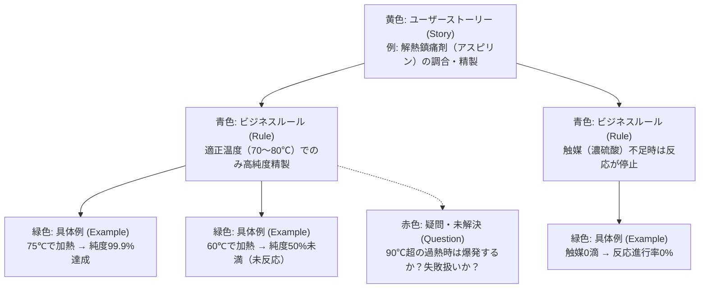

# 要求開発ガイドライン (Requirements Development)

『ソフトウェア要求 第4版』の原則に基づき、本プロジェクトでは**「何を実現するか（What）」と「どのように実装するか（How）」を厳格に分離**する。
機能要求・非機能要求（品質シナリオ）の定義に加え、**要求文書および個々の要求記述が満たすべき品質特性**、および**実例マッピング（Example Mapping）による仕様具体化**を遵守する。

---

## 1. BRIEF 原則（要求記述の基本規約）

要求書には、ユーザーにとって意味のある「状態の変更」と「操作の振る舞い」のみを必要最低限かつ簡潔に記載する。

- **観測可能な状態 (Observable State)**:
  - 元素の数・種類、器具の温度、試薬の純度（%）、環境フラグ、キャラクターの状態（会話/信頼度）。
- **観測可能な操作 (Observable Operations)**:
  - 元素の選択・追加、加熱・冷却操作、ろ過/撹拌の実行、試薬の提供、会話の選択肢実行。
- **記載しない内容 (Implementation Leakage)**:
  - px 単位の詳細なレイアウト、色の逐一指定、特定フレームワークの関数名、コンポーネントの細粒度仕様、DBのテーブル構造やSQL。

---

## 2. 要求文書に求められる特性 (Characteristics of Requirement Documents)

要求仕様書（`docs/requirements/` 内の文書全体）は、以下の 5 つの品質特性を満たさなければならない。

1. **完全性 (Complete)**:
   - 必要な機能・制約・品質属性が漏れなく記述されており、「TBD（未定）」や「後で検討」を放置しない。
2. **一貫性 (Consistent)**:
   - 要求文書内で定義された要求同士が衝突・矛盾していないこと（例: ある箇所で「純度90%以上で成功」と書き、別の箇所で「純度95%以上で成功」と書くことを禁止する）。
3. **修正可能性 (Modifiable)**:
   - 構造化され、目次や要求 ID（`REQ-xxx`）が整理されており、仕様変更時に最小限の変更で誤解なく更新できること。
4. **追跡可能性 (Traceable)**:
   - 各要求の由来（ビジネス要件/ユーザー要件）と、対応するテストコード（受け入れテスト・統合テスト）への相互リンクが維持されていること。
5. **有効性 / 実用性 (Effective / Useful)**:
   - 開発者および AI エージェントが読んで正しく設計・実装の判断を下せる情報量になっていること。

---

## 3. 個々の要求記述に求められる特性 (Characteristics of Requirement Statements)

各要求項目（`REQ-xxx` や `NFR-xxx` の1文）は、以下の 9 つの品質特性を満たすように記述する。

| 特性 (Characteristic) | 定義・ルール | 悪い例 (Bad) | 良い例 (Good) |
| :--- | :--- | :--- | :--- |
| **1. 正確性 (Accurate)** | ドメイン知識およびビジネス目的に合致している。 | 「適当な温度で精製する」 | 「70℃〜80℃の範囲で加熱し精製する」 |
| **2. 妥当性 (Feasible)** | 技術的・コスト的に実現可能である。 | 「AIがリアルタイムで無限の分子反応を完全物理シミュレーションする」 | 「定義された元素結合テーブルに従い純度を計算する」 |
| **3. 必要性 (Necessary)** | ユーザーやシステムにとって本当に価値がある（不要な飾りでない）。 | 「ボタンを押した際に豪華な3D紙吹雪が10秒舞う」 | 「精製成功時に純度99.9%を示す青いエフェクトを表示する」 |
| **4. 優先順位付け (Prioritized)** | 開発順序・重要度（Must / Should / Could）が明確。 | （すべての要求が同等に並んでいる） | `[Must]` `REQ-CHEM-01`: アスピリン精製 |
| **5. 明確性 / あいまいさがない (Unambiguous)** | 読者によって解釈が分かれない単一の意味を持つ。 | 「操作を素早く行うと大成功になる」 | 「加熱から3秒以内に精製ボタンを押すと大成功になる」 |
| **6. 検証可能性 (Verifiable)** | テスト（自動/手動）で Pass/Fail を一義的に判断できる。 | 「画面を使いやすくする」 | 「Given-When-Then 形式で記述され、Assert可能である」 |
| **7. 簡潔性 (Concise)** | 余計な修飾語を排し、1つの要求文には1つの主張のみを含める。 | 「加熱と冷却とろ過を同時に行い、UIの色も変えてログも吐く」 | 1つの要求につき1つの操作と結果に分解して記述 |
| **8. 抽象度の一貫性 (Implementation-Free)** | 実装詳細（クラス名、HTMLタグ、CSS等）に非依存である。 | 「`
`タグ内の `PurityState` を更新する」 | 「観測可能な純度状態を更新する」 |
| **9. 追跡可能性 (Traceable)** | 固有の識別子（REQ ID）を持つ。 | 「解熱剤の調合ロジック」 | `REQ-CHEM-01` |

---

## 4. 実例マッピングによる要求具体化 (Example Mapping)

要求の解釈違いやスコープの肥大化を防ぎ、短時間で共通理解（Shared Understanding）を構築するため、機能要求の作成前段として**実例マッピング (Example Mapping)** を実施する。

### 4.1. 4 色の要素構成
実例マッピングでは、以下の 4 つの要素を用いて仕様を構造化する。

1. **Story (黄色: ストーリー)**:
   - 議論の対象となる機能の最小単位（短く明確な価値）。
2. **Rule (青色: ビジネスルール / 受入条件)**:
   - ストーリーの振る舞いを決定づけるビジネス制約・条件。
3. **Example (緑色: 具体例 / 実例)**:
   - 各ルールを説明・実証する具体的なインプットとアウトプットの組み合わせ。
4. **Question (赤色: 疑問・未解決事項)**:
   - ドメインエキスパートへの確認が必要な点、または技術的な不確実性。

### 4.2. 実例マッピングの進行ルール
- **タイムボックス**: 1 つのストーリーにつき **25分以内** でディスカッションを完了させる。
- **ストーリー分割のシグナル**:
  - ルール（青）が多すぎる（目安: 4つ以上）場合、ストーリーが大きすぎるため即座に分割する。
- **調査（Spike）のシグナル**:
  - 疑問（赤）が多数残る場合、仕様が未成熟であるため実装に着手せず、スパイク調査や仕様ヒアリングに回す。

### 4.3. 実例マッピングから受け入れテストへの変換フロー
実例マッピングで確定した **Rule（ルール）** と **Example（具体例）** は、そのまま後述の **Given-When-Then (BDD)** 形式の機能要求および受け入れテストコードへと 1 対 1 で昇華させる。

---

## 5. 機能要求の記述形式 (BDD / Given-When-Then)

実例マッピングの成果に基づき、機能要求は Given-When-Then / BDD 形式（日本語）で記述する。

### 5.1. 記述テンプレート
- **要求 ID**: `REQ-XXX-NN` `[優先度: Must | Should | Could]`
- **タイトル**: [要求の簡潔な要約]
- **前提条件 (Given)**: [システム・ドメインの初期状態]
- **操作・イベント (When)**: [ユーザーや外部による単一の操作・刺激]
- **期待結果 (Then)**: [観測可能な状態の変化・出力結果]

### 5.2. 記述例
- **要求 ID**: `REQ-CHEM-01` `[Must]`
- **タイトル**: アスピリン精製処理
- **Given**: サリチル酸と無水酢酸がフラスコに投入され、触媒として濃硫酸が添加されている
- **When**: 70℃〜80℃の適正温度で加熱攪拌を実行する
- **Then**: 純度99.9%のアスピリンが生成され、フラスコの状態が「精製完了」に更新される

---

## 6. 非機能要求の記述形式：品質シナリオ (Quality Scenarios)

非機能要求（応答性・堅牢性等）は、測定不能な形容詞を排除し、**6 つの構成要素（源・刺激・環境・対象・応答・応答尺度）** を含む品質シナリオとして定量記述する。

### 品質シナリオの記述例
- **要求 ID**: `NFR-PERF-01` `[Must]`
- **源**: ユーザー
- **刺激**: 「精製」ボタンを押下する
- **環境**: 通常ゲームプレイ時
- **対象**: `PurityCalculator`（純度計算エンジン）
- **応答**: 入力条件に応じた純度結果（%）を算出する
- **応答尺度**: **UI描画完了まで100ms以内**にレスポンスし、同一の入力に対して**100%同一の計算結果（誤差0%）**を返すこと
