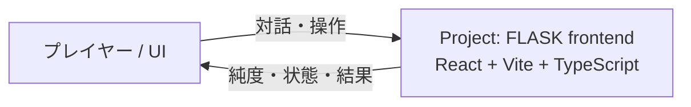
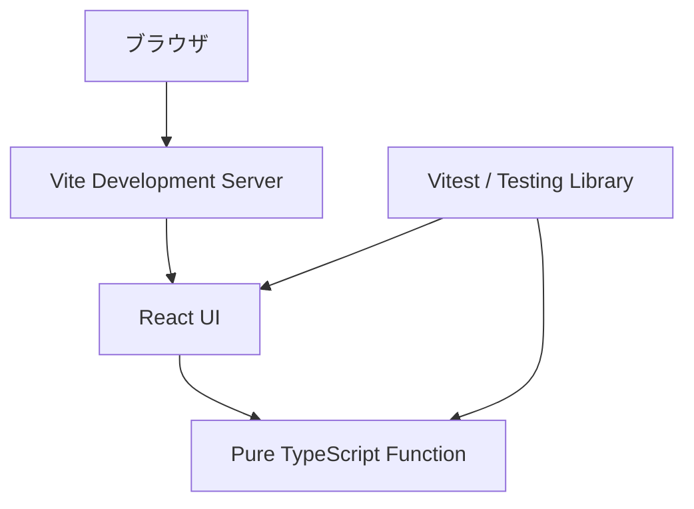
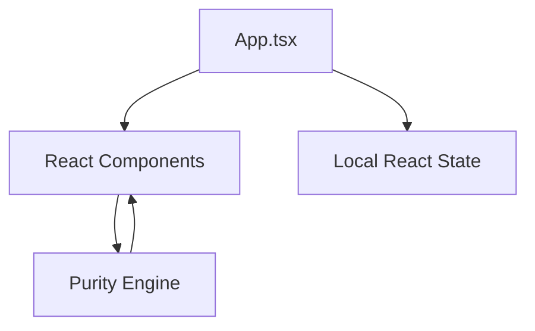

# Project: FLASK — アーキテクチャ設計書 (Architecture Document)

- **バージョン**: 1.1.0
- **策定日**: 2026-10-06
- **ステータス**: Approved
- **対象**: React / Vite / TypeScript スタンドアロンフロントエンド
- **準拠ガイドライン**: [`.github/skills/architecture/SKILL.md`](../.github/skills/architecture/SKILL.md) / C4 Model 準拠

## 1. システム概要

Project: FLASK は、Python / Flask のバックエンドではなく、React、Vite、TypeScriptを使用したスタンドアロンなフロントエンド Web アプリである。ブラウザ内で UI、状態、決定論的な化学シミュレーションを完結させる。

### 基本方針

1. **フロントエンド単独性**: 外部API、Pythonプロセス、Flask、データベースを使用しない。
2. **決定論的シミュレーション**: 同じ入力に対して同じ純度・状態を返す純粋な関数を使用する。
3. **型安全性**: TypeScript strict modeとViteの本番ビルドで型とバンドルを検証する。
4. **テスト可能性**: UI操作と純度計算を実コンポーネントテストで検証する。

## 2. C4 Model

### 2.1 System Context



### 2.2 Container



### 2.3 Component



## 3. レイヤー構成

```text
src/
├── App.tsx                 # UI、状態フロー、要求IDの表示
├── main.tsx                 # Reactエントリーポイント
├── lib/
│   └── purityEngine.ts      # 純度計算と反応制約の純粋関数
└── styles.css              # レスポンシブUI
```

### 依存ルール

- `App.tsx` は `purityEngine.ts` の公開APIのみを利用する。
- `purityEngine.ts` はReact、DOM、外部API、Python、Flaskを参照しない。
- UIの状態変更は内部のReact stateに限定する。
- 外部API、DB、サーバーへのアクセスは新規要件時に追加する。

## 4. 検証

| 区分 | ツール | 合否基準 |
| --- | --- | --- |
| UI | Vitest + Testing Library | 主要な対話操作が成功する |
| 純度計算 | Vitest | 同一入力で100%一致する |
| TypeScript | tsc | エラー0件 |
| Production build | Vite | ビルド成功 |
| Lint | ESLint | 警告0件 |

## 5. ADR

- [ADR-0001: Clean Architecture pattern](./adr/0001-clean-architecture-adoption.md)
- [ADR-0002: Deterministic Purity Engine](./adr/0002-deterministic-purity-engine.md)
- [ADR-0003: React / Vite / TypeScript standalone frontend](./adr/0003-react-vite-standalone-frontend.md)
