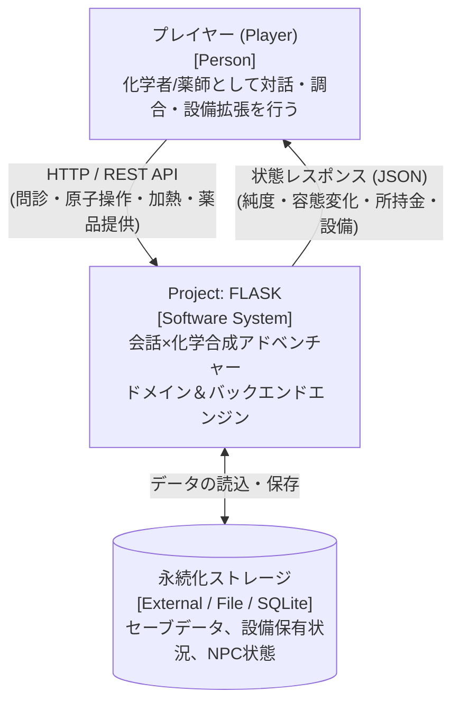
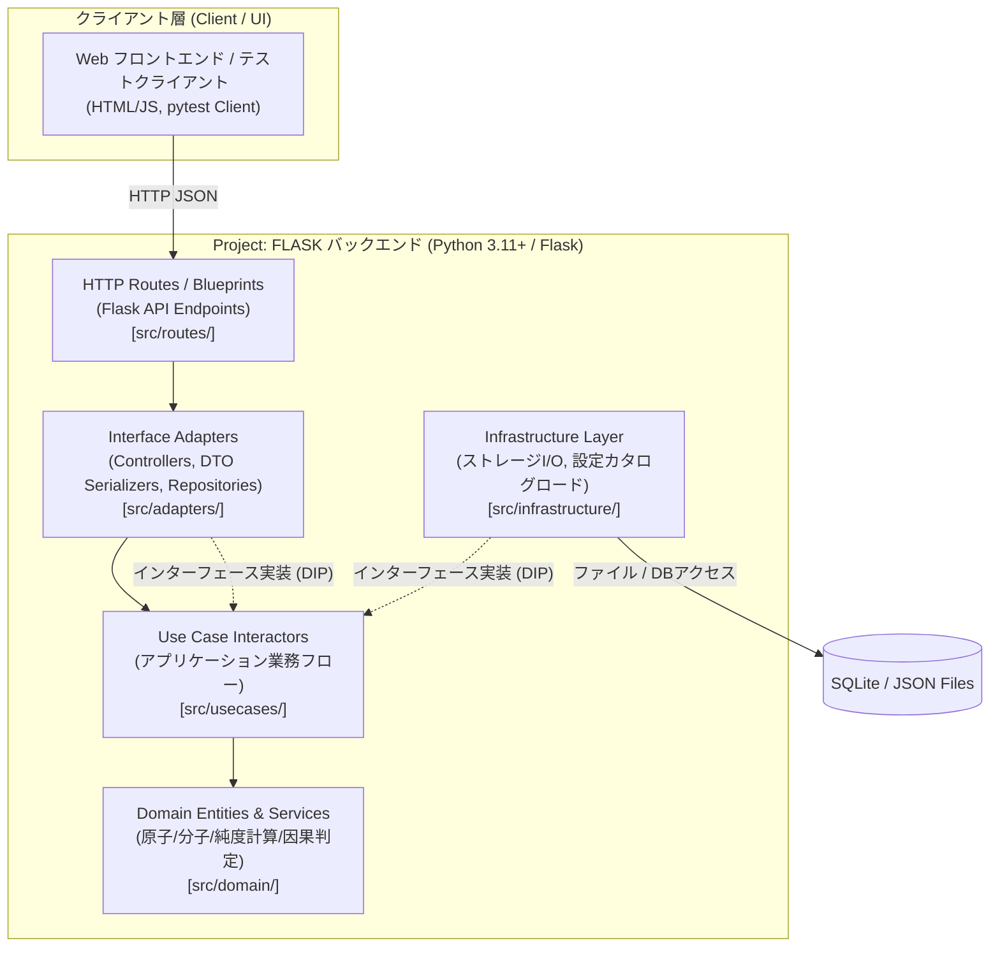

# Project: FLASK — アーキテクチャ設計書 (Architecture Document)

- **バージョン**: 1.0.0
- **策定日**: 2026-10-06
- **ステータス**: 承認済 (Approved)
- **準拠ガイドライン**: [`.github/skills/architecture/SKILL.md`](../.github/skills/architecture/SKILL.md) / C4 Model 準拠

---

## 1. システム概要とアーキテクチャ方針

『Project: FLASK』は、**Clean Architecture（クリーンアーキテクチャ）**に基づき構築される Python / Flask バックエンドシステムである。

### 基本方針
1. **ドメイン層の完全な純粋性**:
   - `src/domain/` は、Flask、SQLAlchemy、サードパーティ製ライブラリに一切依存しない。純粋な Python 標準ライブラリのみで構成する。
2. **決定論的シミュレーション**:
   - 物理化学計算（原子結合、温度・触媒反応、純度計算）は決定論的モデルとし、同一入力に対して 100% 同一の出力を保証する。
3. **境界の自動保護 (Fitness Functions)**:
   - レイヤー間の依存方向違反および品質低下（カバレッジ・複雑度）は、CI 上の自動適合度関数（`import-linter`, `pytest-cov`, `mypy --strict`）によって機械的にブロックする。

---

## 2. C4 Model による構造記述

### 2.1. System Context Diagram (Level 1)
システム全体の境界と外部アクターとの関係を示す。



### 2.2. Container Diagram (Level 2)
バックエンド内部の論理コンテナおよび実行環境を示す。



### 2.3. Component Diagram (Level 3: Core Domain & UseCases)
ドメイン層およびユースケース層の内部コンポーネント構成と相互関係。

```mermaid
classDiagram
    namespace Domain_Layer {
        class Atom {
            +element: Element
            +valence: int
            +remaining_bonds: int
        }
        class Molecule {
            +formula: str
            +bonds: List[Bond]
            +is_closed() bool
        }
        class Purity {
            +percentage: float
            +has_toxic_impurities: bool
            +is_miracle() bool
        }
        class Equipment {
            +id: str
            +tier: int
            +temp_variance: float
            +purity_cap: float
        }
        class Patient {
            +id: str
            +condition: str
            +hp: int
            +relationship: int
        }
        class PurityCalculator {
            +calculate_purity(temp, catalyst, equipment) Purity
        }
        class MolecularMatcher {
            +identify_molecule(molecule) KnownMolecule
        }
        class DispensationEngine {
            +evaluate_consequence(patient, medicine, purity) DispensationResult
        }
    }

    namespace UseCase_Layer {
        class PurifyMedicineUseCase {
            +execute(request) PurificationResponse
        }
        class SynthesizeMoleculeUseCase {
            +execute(request) SynthesisResponse
        }
        class DispenseMedicineUseCase {
            +execute(request) DispensationResponse
        }
        class UpgradeEquipmentUseCase {
            +execute(request) UpgradeResponse
        }
    }

    PurifyMedicineUseCase --> PurityCalculator
    PurifyMedicineUseCase --> Equipment
    PurifyMedicineUseCase --> Purity
    SynthesizeMoleculeUseCase --> MolecularMatcher
    SynthesizeMoleculeUseCase --> Molecule
    DispenseMedicineUseCase --> DispensationEngine
    DispenseMedicineUseCase --> Patient
```



---

## 3. レイヤー構成と依存関係ルール (Dependency Rules)

```text
src/
├── domain/            # 【最内層】純粋なビジネスモデル（外部依存禁止・標準ライブラリのみ）
│   ├── entities/      # Atom, Molecule, Equipment, Patient, Visitor
│   ├── values/        # Purity, Temperature, Element, Formula
│   ├── services/      # PurityCalculator, MolecularMatcher, DispensationEngine
│   └── exceptions.py  # ドメイン例外 (ValenceExceededError, InsufficientManaError 等)
│
├── usecases/          # 【応用層】ユースケース調整（Domain のみ依存、抽象ポート定義）
│   ├── purification/  # UC-03: 反応・純度計算フロー
│   ├── synthesis/     # UC-02: 原子生成・分子構築フロー
│   ├── dispensation/  # UC-04: 薬品提供・因果判定フロー
│   ├── progression/   # UC-05: 設備購入・換装フロー
│   └── consultation/  # UC-01: 問診・診断フロー
│
├── adapters/          # 【変換層】Flask Blueprint, リクエスト/レスポンス変換
│   ├── controllers/   # 各ユースケースの呼び出しとHTTPレスポンス整形
│   ├── schemas/       # 入出力バリデーション DTO
│   └── repositories/  # リポジトリ具象実装 (インメモリ / ファイル / DB)
│
├── infrastructure/    # 【最外層】フレームワーク・外部環境具象
│   ├── config/        # YAML設定ローダー (設備カタログ、既知分子辞書)
│   └── persistence/   # SQLite / SQLAlchemy エンジン設定
│
└── app.py             # Flask アプリケーションファクトリ (Create App / DI ワイヤリング)
```

### 厳格なルール
1. **単方向依存 (Inward Dependency)**:
   - `domain` $\leftarrow$ `usecases` $\leftarrow$ `adapters` $\leftarrow$ `routes / app.py`
   - `domain` はどのディレクトリからもインポートされない独立した純粋層であること。
2. **依存性逆転 (DIP)**:
   - ユースケース層がストレージや外部設定を必要とする場合、`usecases` 内に Protocol/Interface（抽象ポート）を定義し、`adapters` または `infrastructure` がそれを実装する。

---

## 4. 自動検証・適合度関数 (Fitness Functions)

| 区分 | 検証ツール | 合否基準 (CI Gate) | 対象レイヤー |
| :--- | :--- | :--- | :--- |
| **依存方向の隔離** | `import-linter` | 違反 **0 件**（`src/domain` からの上位インポート完全禁止） | `src/domain` |
| **ドメインカバレッジ** | `pytest-cov` | ブランチカバレッジ **95% 以上** | `src/domain/` |
| **ユースケースカバレッジ**| `pytest-cov` | ブランチカバレッジ **85% 以上** | `src/usecases/` |
| **全体カバレッジ** | `pytest-cov` | ブランチカバレッジ **80% 以上** | プロジェクト全体 |
| **型安全性** | `mypy` | `--strict` オプションでエラー **0 件** | `src/` 全域 |
| **巡回複雑度** | `flake8` / `radon` | 関数ごとの循環的複雑度 **10 以下** | `src/` 全域 |
| **計算決定論性** | `pytest` | 同一入力に対する出力一致率 **100.0%** (誤差 0%) | `PurityCalculator` |

---

## 5. アーキテクチャ決定記録 (ADR) 一覧

- [`ADR-0001: Clean Architecture パターンの採用`](./adr/0001-clean-architecture-adoption.md)
- [`ADR-0002: 純度計算エンジンの決定論的モデル設計`](./adr/0002-deterministic-purity-engine.md)
