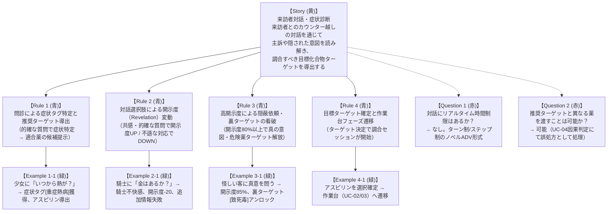

# 実例マッピング: 来訪者対話・症状診断 (Visitor Consultation & Diagnosis)

- **対象ストーリー**: UC-01 来訪者対話・症状診断 — 患者・客との問診による症状分析と調合ターゲット導出
- **実施日**: 2026-10-06
- **タイムボックス**: 25分
- **ステータス**: 確定 (Confirmed)

---

## 1. 4 色の要素構成 (Example Mapping Board)

---

## 2. 要素の詳細定義

### 2.1. ユーザーストーリー (Story)
- **タイトル**: 来訪者対話・症状診断
- **価値**: 『VA-11 Hall-A』のバーテンダー的対話と『ブレイキング・バッド』の危険な裏取引の緊張感を体現。言葉の端々から本音を察知し、医療人として救うか、裏の依頼に応じるかの選択肢をプレイヤーに提示する。

### 2.2. ビジネスルール (Rules)
- **Rule 1 (問診と症状特定)**: 来訪者の発話に対して適切な問診選択肢を実行すると、症状タグ（例: `[発熱]`, `[炎症]`）がアンロックされ、適合する薬品ターゲット（例: アスピリン）が推奨される。
- **Rule 2 (開示度変動)**: プレイヤーの選択肢に応じて来訪者の開示度（Revelation Level: 0〜100%）が変動する。好意的な質問で上昇し、不遜・金銭優先の態度で低下する。
- **Rule 3 (裏ターゲットの看破)**: 危険な裏の意図を持つ来訪者に対し、開示度が 80% 以上に達した場合、隠蔽フラグが解除され、表向きの薬とは異なる「真のターゲット（例: 致死毒、禁忌薬）」が調合候補として解放される。
- **Rule 4 (フェーズ遷移)**: プレイヤーが目標ターゲットを選択して確定すると、問診フェーズから作業台フェーズ（UC-02 / UC-03）へ正式に移行する。

### 2.3. 具体例 (Examples)
| No | 来訪者 | 選択肢 / 行動 | 開示度変化 | 獲得情報 / タグ | 解放ターゲット | 判定結果 |
| :--- | :--- | :--- | :--- | :--- | :--- | :--- |
| **Ex 1-1** | 熱病の少女 | 「いつから熱があるの？」 | +20% (計40%) | `[重症熱病]`, `[炎症]` | `Aspirin` (推奨) | 診断成功 |
| **Ex 2-1** | 負傷した騎士 | 「前払いで金はあるのか？」 | -20% (計10%) | 獲得なし（怒り） | なし（情報不足） | 問診失敗 |
| **Ex 3-1** | 謎の紳士 | 「誰にその薬を使う気だ？」 | +30% (計85%) | `[暗殺意図]`, `[無痛死]` | `Poison` (裏ターゲット) | 看破成功 |
| **Ex 4-1** | 少女の依頼 | `Aspirin` を選択して確定 | - | 依頼アクティブ化 | 作業台へ遷移 | セッション開始 |

### 2.4. 解決済み疑問 (Questions Resolved)
- **Q1 (時間制限)**: ステップ実行のステートレスAPIとし、時間制限による強制終了はバックエンドの責務としない。
- **Q2 (自由な提出)**: 導出されたターゲットは「クエスト目標」であり、作業台で何を合成して患者に渡すかはプレイヤーの自由（UC-04 で評価）。

---

## 3. 次のアクション
本実例マッピングに基づき、機能要求（`REQ-TALK-01`〜`04`）および品質シナリオ（`NFR-NARR-01`）を `docs/requirements/data/dialogue.yml` に定義する。
