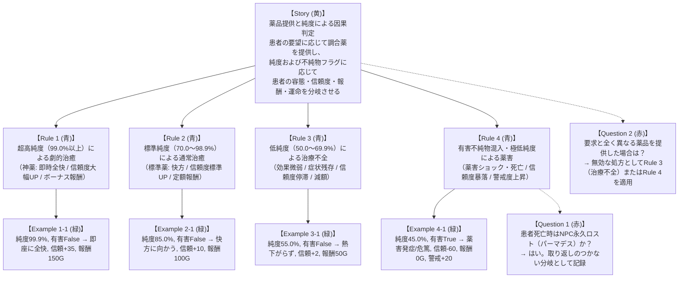

# 実例マッピング: 薬品提供と純度による因果判定 (Drug Dispensation & Fate Branching)

- **対象ストーリー**: UC-04 薬品提供・因果判定 — 患者への薬品提供と純度別運命分岐
- **実施日**: 2026-10-06
- **タイムボックス**: 25分
- **ステータス**: 確定 (Confirmed)

---

## 1. 4 色の要素構成 (Example Mapping Board)

---

## 2. 要素の詳細定義

### 2.1. ユーザーストーリー (Story)
- **タイトル**: 薬品提供と純度による因果判定
- **価値**: プレイヤーの精製技術（純度）が客の人生や生死を直接左右し、街での評判やサスペンスフルな運命分岐（『ブレイキング・バッド』×『VA-11 Hall-A』）を体感させる。

### 2.2. ビジネスルール (Rules)
- **Rule 1 (超高純度 / 神薬)**: 純度 99.0% 以上の適合薬品を提供した場合、患者の症状は即座に完全寛解する。NPC信頼度が大幅上昇（+30以上）し、特別ボーナス報酬および名声が付与される。
- **Rule 2 (標準純度 / 合格)**: 純度 70.0%〜98.9% の適合薬品を提供した場合、患者の症状は快方に向かう。NPC信頼度は標準上昇（+10）し、定額報酬が付与される。
- **Rule 3 (低純度 / 治療不全)**: 純度 50.0%〜69.9% の薬品を提供した場合、薬効が不十分で症状が残存する。NPC信頼度の変動は極小（$\le$ +2）にとどまり、報酬は減額（50%）される。
- **Rule 4 (有害不純物・粗悪品 / 薬害)**: 有害不純物フラグが True、または純度 50.0% 未満の薬品を提供した場合、患者は薬害ショックを発症し容態が悪化（最悪死亡）する。NPC信頼度は暴落（-50以上）、報酬は0、街の警戒度（WANTEDレベル）が上昇する。

### 2.3. 具体例 (Examples)
| No | 患者症状 | 提供薬品 | 純度 | 有害フラグ | 容態変化 | 信頼度変動 | 報酬 | 警戒度 | 判定結果 |
| :--- | :--- | :--- | :--- | :--- | :--- | :--- | :--- | :--- | :--- |
| **Ex 1-1** | 重症熱病 (HP 20) | アスピリン | **99.9%** | False | **全快 (HP 100)** | **+35** (親愛) | **150G** (特上) | 0 | 神薬 |
| **Ex 2-1** | 重症熱病 (HP 20) | アスピリン | **85.0%** | False | **快方 (HP 60)** | **+10** (感謝) | **100G** (定額) | 0 | 標準薬 |
| **Ex 3-1** | 重症熱病 (HP 20) | アスピリン | **55.0%** | False | **微変 (HP 30)** | **+2** (困惑) | **50G** (減額) | 0 | 不全 |
| **Ex 4-1** | 重症熱病 (HP 20) | アスピリン | **45.0%** | **True** | **危篤 (HP 5)** | **-60** (敵対) | **0G** | **+20** | 薬害・破滅 |

### 2.4. 解決済み疑問 (Questions Resolved)
- **Q1 (NPC パーマデス)**: 薬害によって HP が 0 に達した患者は永久死亡し、以後の関連クエストや来店は恒久的に消失する。
- **Q2 (不適合な薬品の提供)**: 要求疾患と無関係な薬品は、純度に関わらず「無効な処方」として判定され、信頼度低下の対象となる。

---

## 3. 次のアクション
本実例マッピングに基づき、機能要求（`REQ-FATE-01`〜`04`）および品質シナリオ（`NFR-INTEG-01`）を `docs/requirements/data/dispensation.yml` に定義する。
