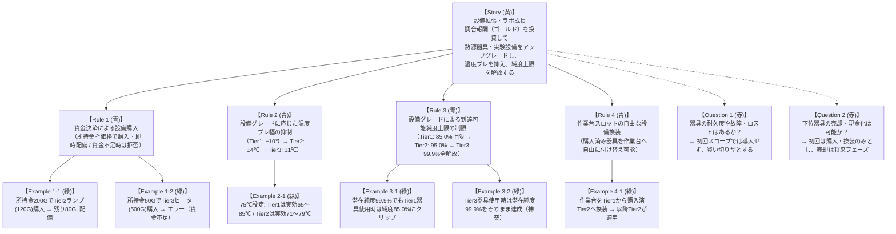

# 実例マッピング: 設備拡張・ラボ成長 (Facility Upgrade & Progression)

- **対象ストーリー**: UC-05 設備拡張・ラボ成長 — 粗末な道具からスーパーラボへの成長とパラメータ向上
- **実施日**: 2026-10-06
- **タイムボックス**: 25分
- **ステータス**: 確定 (Confirmed)

---

## 1. 4 色の要素構成 (Example Mapping Board)

---

## 2. 要素の詳細定義

### 2.1. ユーザーストーリー (Story)
- **タイトル**: 設備拡張・ラボ成長
- **価値**: 『ブレイキング・バッド』のスーパーラボ構築の達成感を体現。ボロ小屋の粗末な道具から高度な化学器具へ設備投資を行い、高純度精製の再現性と成功率を高める。

### 2.2. ビジネスルール (Rules)
- **Rule 1 (資金決済による設備購入)**: プレイヤーは設備カタログから器具を購入できる。所持金が価格以上の場合は資金が減額されて所持設備に追加される。資金不足の場合は購入が拒否される。
- **Rule 2 (温度ブレ幅の抑制)**: 器具のグレード（Tier）に応じて加熱時の温度ブレ幅が縮小する（Tier 1: $\pm 10$℃, Tier 2: $\pm 4$℃, Tier 3: $\pm 1$℃）。
- **Rule 3 (純度上限の解放)**: 器具のグレードによって到達可能な純度の上限値（Purity Cap）が制限される（Tier 1: 85.0%, Tier 2: 95.0%, Tier 3: 99.9%）。潜在計算値がこの上限を超過した場合、上限値にクリップされる。
- **Rule 4 (作業台の設備換装)**: 所持している設備を作業台のスロットへ自由に付け替えることができる。

### 2.3. 具体例 (Examples)
| No | 器具名 | Tier | 価格 | 温度ブレ幅 | 純度上限 | 期待動作 | 判定結果 |
| :--- | :--- | :--- | :--- | :--- | :--- | :--- | :--- |
| **Ex 1-1** | 真鍮製アルコールランプ | Tier 2 | 120G | $\pm 4$℃ | 95.0% | 所持金 200G $\to$ 80G で購入配備 | 購入成功 |
| **Ex 1-2** | 精密マントルヒーター | Tier 3 | 500G | $\pm 1$℃ | 99.9% | 所持金 50G で購入試行 | 資金不足拒否 |
| **Ex 2-1** | 粗末な焚火 vs ランプ | T1 vs T2 | - | $\pm 10$℃ vs $\pm 4$℃ | - | 75℃設定時、T2なら71〜79℃を維持 | 制御精度向上 |
| **Ex 3-1** | 粗末な焚火（クリップ） | Tier 1 | 初期 | $\pm 10$℃ | **85.0%** | 最適条件（潜在99.9%）でも85.0%に制限 | 上限クリップ |
| **Ex 3-2** | 精密ヒーター（解放） | Tier 3 | 500G | $\pm 1$℃ | **99.9%** | 最適条件で99.9%の神薬を生成可能 | 上限解放 |
| **Ex 4-1** | 設備換装 | T1 $\to$ T2 | - | - | - | 作業台スロットを換装してT2有効化 | 換装成功 |

### 2.4. 解決済み疑問 (Questions Resolved)
- **Q1 (耐久度・故障)**: 初回スコープでは管理せず、購入した器具は永続的に使用可能とする。
- **Q2 (器具の売却)**: 初回は購入のみサポートし、売却による資金回収は対象外とする。

---

## 3. 次のアクション
本実例マッピングに基づき、機能要求（`REQ-LAB-01`〜`04`）および品質シナリオ（`NFR-CONFIG-01`）を `docs/requirements/data/progression.yml` に定義する。
