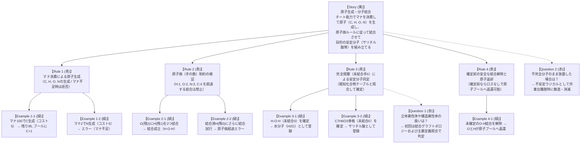

# 実例マッピング: 原子生成・分子結合 (Atom Generation & Molecular Synthesis)

- **対象ストーリー**: UC-02 原子生成・分子結合 — チート能力による原子プール操作と分子骨格組み立て
- **実施日**: 2026-10-06
- **タイムボックス**: 25分
- **ステータス**: 確定 (Confirmed)

---

## 1. 4 色の要素構成 (Example Mapping Board)

---

## 2. 要素の詳細定義

### 2.1. ユーザーストーリー (Story)
- **タイトル**: 原子生成・分子結合
- **価値**: 『異世界薬局』の主人公チート能力を体現。何もない空間から原子を生み出し、高校化学の原子価パズルを通じて医薬品の基礎原料を作り上げる。

### 2.2. ビジネスルール (Rules)
- **Rule 1 (マナ消費による原子生成)**: プレイヤーはマナを消費して原子プールに指定原子（C: 炭素, H: 水素, O: 酸素, N: 窒素）を生成する。必要マナ（一律5マナ/個）に満たない場合は生成がブロックされる。
- **Rule 2 (原子価制約)**: 原子ごとに許容される最大結合手（H=1, O=2, N=3, C=4）が厳格に適用される。上限を超える結合形成操作は即時バリデーションエラーとなる。
- **Rule 3 (安定分子の同定)**: 分子構造内のすべての原子の未結合手が 0 になった（完全閉塞）状態で確定操作を行うと、定義済み化合物テーブル（水、サリチル酸、無水酢酸等）と照合され、試薬インベントリに正式登録される。
- **Rule 4 (確定前リセット・返還)**: 作業台上で確定する前であれば、プレイヤーはいつでも結合を解除し、原子プールへ無損失で原子を回収できる。

### 2.3. 具体例 (Examples)
| No | 操作内容 | 初期状態 | 入力・対象 | 出力・結果状態 | 判定結果 |
| :--- | :--- | :--- | :--- | :--- | :--- |
| **Ex 1-1** | 炭素生成 | マナ 100, C: 0 | 原子 C 生成 (コスト 5) | マナ 95, C: 1 | 成功 |
| **Ex 1-2** | 窒素生成 | マナ 2, N: 0 | 原子 N 生成 (コスト 5) | マナ 2, N: 0 (エラー: マナ不足) | 拒否 |
| **Ex 2-1** | 水素と酸素の結合 | O (残手 2), H (残手 1) | 単結合形成 | O (残手 1) - H (残手 0) | 結合成功 |
| **Ex 2-2** | 水素への重複結合 | H (残手 0) | 別の原子との結合形成 | エラー: 最大結合価 (1) 超過 | 拒否 |
| **Ex 3-1** | 水分子の確定 | H-O-H (未結合 0) | 確定ボタン押下 | 試薬 `Water` (H2O) 獲得 | 同定成功 |
| **Ex 3-2** | サリチル酸の確定 | C7H6O3 骨格 (未結合 0) | 確定ボタン押下 | 試薬 `SalicylicAcid` 獲得 | 同定成功 |
| **Ex 4-1** | 結合解除・回収 | O-H 結合体 | 解除・回収操作 | O: +1, H: +1 がプールに返還 | 回収成功 |

### 2.4. 解決済み疑問 (Questions Resolved)
- **Q1 (異性体照合)**: 初回リリースでは、2次元結合グラフの同型性判定（Graph Isomorphism）に基づき、登録済み化合物辞書と照合する。
- **Q2 (未完成構造の扱い)**: 作業台に未結合手が残った状態でセッションを終了（破棄）した場合、原子は回収されず空気中に散逸（消滅）する。

---

## 3. 次のアクション
本実例マッピングに基づき、機能要求（`REQ-ATOM-01`〜`04`）および品質シナリオ（`NFR-GRAPH-01`）を `docs/requirements/data/synthesis.yml` に定義する。
