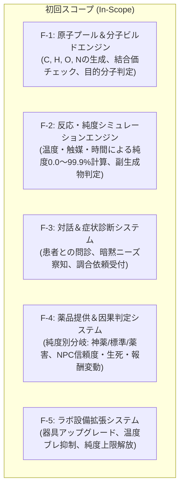
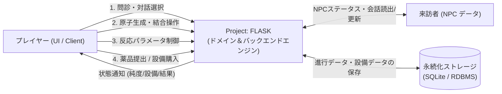
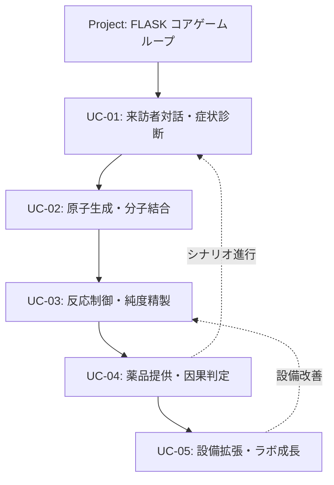
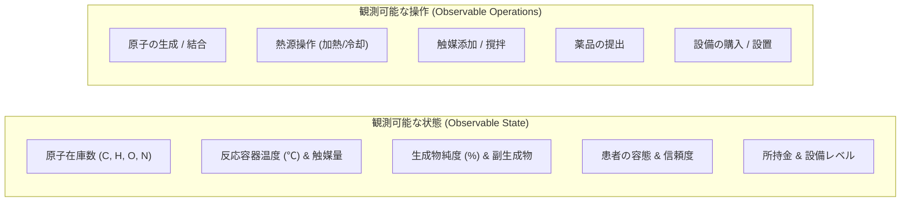

# Project: FLASK — ビジョン・スコープ定義書 (Vision and Scope Document)

- **文書バージョン**: 1.0.0
- **策定日**: 2026-10-06
- **ステータス**: 承認済 (Approved)
- **準拠規格**: 『ソフトウェア要求 第4版』(Karl Wiegers & Joy Beatty) 第5章 / ISO/IEC 29148

---

## 1. ビジネス要求 (Business Requirements)

### 1.1. 背景 (Background)
クラフト系ゲームやアドベンチャーゲームの多くは、あらかじめ用意された「定型レシピ」をクリックしてアイテムを生成する単純な作業に終始している。また、ストーリー分岐も固定の会話選択肢のみに依存しており、プレイヤー自身の試行錯誤やクラフトの品質が世界に直接干渉する感覚に乏しい。

『Project: FLASK』は、以下の 3 つの強力なエッセンスを融合させた独自の会話×化学合成アドベンチャーゲームのバックエンドおよびドメインエンジンである。
1. **『異世界薬局』**: 現代の科学・薬学知識と、原子（C, H, O, N等）を自在に生成・操作するチート能力。
2. **『ブレイキング・バッド』**: 反応パラメータ（温度、触媒、撹拌、時間）の緻密な制御により極限の「純度（Purity: 99.9%）」を追求するプロフェッショナリズムと、粗末な小屋からスーパーラボへと至る設備拡張の快感。
3. **『VA-11 Hall-A』**: カウンター越しの対話を通じて客（患者）の要望・症状・裏の意図を読み解き、提供した薬品の純度・成分によって相手の運命や街の情勢が劇的に分岐するナラティブ体験。

### 1.2. ビジネス機会・コア提供価値 (Business Opportunity)
物理化学シミュレーション（決定論的反応モデル）とアドベンチャーゲームの会話・運命分岐システムを直結させる。プレイヤーに対して「自らの手で原子を組み上げ、パラメータをミリ単位で調整して生み出した高純度薬品が、患者を救い、あるいは破滅させる」という唯一無二の没入感を提供する。

### 1.3. ビジネス目標とサクセスメトリクス (Business Objectives & Success Metrics)

| 区分 | 指標 (Metric) | 目標値 (Target) | 測定方法 |
| :--- | :--- | :--- | :--- |
| **品質・精度** | 純度計算の決定論性 (Determinism) | 100% 同一入力に対して完全一致 | 単体/受け入れテストによる自動検証 |
| **パフォーマンス** | 反応・純度計算エンジン応答速度 | 100ms 以内 (P99) | ベンチマーク・パフォーマンステスト |
| **拡張性** | 新規化学物質・反応ルールの追加容易性 | 1 分子あたり 15 分以内で YAML 定義・登録可能 | ドメインモデルの独立性と設定駆動設計 |
| **アーキテクチャ** | ドメイン層の純粋性 (Fitness Function) | 外部依存・Flask/DB依存 0 件 | `import-linter` による CI 検証 |

### 1.4. ビジョンステートメント (Vision Statement)

```text
【対象】: 思考型クラフトシミュレーションと重厚な選択・ストーリー体験を求めるプレイヤー
【課題】: 定型レシピ作業や単調な選択肢分岐に飽き足らず、自分の技術や判断が直接結果に跳ね返る体験を欲している
【製品】: 『Project: FLASK』は
【カテゴリ】: Clean Architecture に基づく会話×化学合成アドベンチャーのドメイン＆バックエンドシステムであり
【提供価値】: 原子操作・パラメータ制御に基づく決定論的純度シミュレーションと、純度に応じたマルチエンディング運命分岐を提供し
【差別化】: 静的レシピ選択や固定フラグに頼る従来作品とは異なり
【独自性】: 物理化学に基づく「純度（Purity）」が直接キャラクターの容態・生死・信頼度を左右するコアメカニクスを備えている
```

### 1.5. ビジネスリスク (Business Risks)
- **化学的厳密性とゲーム的爽快感の乖離**: 現実の量子化学・分子軌道シミュレーションを忠実に再現しすぎると計算負荷が爆発し、プレイヤーの直感とも乖離するリスクがある。
  - *軽減策*: ドメイン層では「簡略化された結合価モデル（C:4, N:3, O:2, H:1）」と「代表的パラメータ（温度帯・触媒・撹拌）の離散/近似モデル」を採用し、ゲームプレイと決定論的再現性を両立する。

---

## 2. スコープと制約事項 (Scope and Limitations)

### 2.1. 主要機能（スコープ内: In-Scope）

本システムの初回リリース（Release 1.0）に含まれるスコープは以下の通り。



1. **F-1: 原子プール＆分子ビルド (Atom Pool & Molecular Builder)**
   - プレイヤーのチート能力に基づく原子生成（C, H, O, N）。
   - 結合手の過不足（原子価）検証、安定分子の構造判定。
2. **F-2: 反応・純度シミュレーション (Reaction & Purity Engine)**
   - 加熱（温度℃）、冷却、触媒添加、撹拌速度、反応時間の入力。
   - 設備性能に応じたブレ（誤差）の付与と、最終生成物の純度（0.0%〜99.9%）の決定論的計算。
   - 不純物・副生成物（毒性・無効成分）の比率算出。
3. **F-3: 対話＆症状診断 (Consultation & Diagnosis)**
   - 来訪者（患者・客）のセリフからの症状抽出、隠された意図（例: 鎮痛を装った毒薬要求など）の検知。
4. **F-4: 薬品提供＆因果判定 (Dispensation & Consequence)**
   - 完成した薬品の引き渡しと、純度しきい値（例: 99.0%以上 / 70.0%以上 / 50.0%未満）による即時・遅延イベント分岐。
   - NPC 信頼度、体調・生死、報酬（資金・名声・警戒度）の更新。
5. **F-5: ラボ設備拡張 (Lab Progression)**
   - 資金を使用した設備購入（粗末な焚火 → アルコールランプ → マントルヒーター、簡易漏斗 → 分液漏斗等）。
   - 設備レベルに応じたパラメータ安定度および到達可能純度上限の引き上げ。

### 2.2. スコープ外（Out-of-Scope / 将来フェーズ）
- **複雑な分子軌道・量子化学計算**: 3次元分子構造の厳密な物理シミュレーション（2次元結合グラフモデルに留める）。
- **リアルタイム3Dグラフィックス描画**: 本システムはバックエンド/ドメインAPIとして完結し、画面描画はフロントエンド（クライアント層）の責務とする。
- **オンラインマルチプレイヤー**: 完全スタンドアロン/シングルプレイヤー体験を前提とする。
- **無制限の有機合成網**: 初回リリースではストーリーに登場する代表的化合物群（アスピリン、クロロホルム、ペニシリン等）に絞り込んで定義する。

### 2.3. 前提条件と依存関係 (Assumptions and Dependencies)
- **決定論的再現性**: 同一の設備・同一の入力・同一のシード値において、純度計算結果は常に 100% 同一でなければならない（Flaky な乱数依存の排除）。
- **Clean Architecture 準拠**: ドメイン層（分子モデル、純度計算式、分岐ルール）は Flask やデータベース、外部ライブラリに一切依存しない純粋な Python で構築する。

### 2.4. 設計および実装の制約事項 (Constraints)
- **言語・環境**: Python 3.11+, Flask (REST API / Routing)
- **型安全性**: `mypy --strict` 準拠（型注釈 100% 必須）
- **依存ルール**: `import-linter` により、`src/domain` からの上位レイヤー参照を CI で機械的にブロックする。
- **変更管理**: リスク管理ガイドライン（1ターン3ファイル原則、Green-to-Green）を遵守する。

---

## 3. コンテキストとユースケース (Context and Use Cases)

### 3.1. ステークホルダーおよびアクター

| アクター | 説明 | 主な関心事 |
| :--- | :--- | :--- |
| **プレイヤー (Player)** | 現代化学の知識と原子生成能力を持つ主人公（薬師/調合師）。 | 目的分子の合成、高純度精製の成功、設備の拡張、ラボの存続。 |
| **来訪者 (Visitor / NPC)** | ボロ小屋を訪れる患者、客、裏社会の仲介人、領主など。 | 苦痛の緩和、病気の治療、目的の達成（時には暗殺や裏稼業）。 |
| **ラボ環境 (Lab)** | 器具・装置・試薬ストックからなる物理的実験空間。 | 適切な熱伝導、安定した撹拌、純度の物理的上限値。 |

### 3.2. システムコンテキスト図 (System Context Diagram)



### 3.3. コアユースケース一覧 (Core Use Cases)



- **UC-01: 来訪者対話・症状診断 (Consultation)**: 患者の容態を把握し、必要な薬品ターゲットを導出する。
- **UC-02: 原子生成・分子結合 (Molecular Synthesis)**: C, H, O, N の原子プールから骨格を組み立てる。
- **UC-03: 反応制御・純度精製 (Reaction & Purification)**: 温度・触媒・撹拌・時間を制御し、目標純度（99.9%等）の薬品を得る。
- **UC-04: 薬品提供・因果判定 (Dispensation & Consequence)**: 患者に薬を渡し、純度に応じた劇的な結果（治癒/死亡/信頼）を発生させる。
- **UC-05: 設備拡張・ラボ成長 (Facility Upgrade)**: 獲得報酬を元手に器具を購入し、ラボの性能を高める。

---

## 4. BRIEF 原則に基づくシステム境界 (BRIEF Boundaries)

『ソフトウェア要求 第4版』の BRIEF 原則に基づき、観測可能な状態・操作と、排除すべき実装詳細を定義する。



### 排除する実装詳細 (Implementation Leakage to avoid)
- UI のピクセル単位のレイアウト、CSS スタイル、色指定。
- フロントエンドコンポーネントの内部構造（React/Vueのステート名など）。
- 特定 DB のテーブル物理構造や SQL クエリ構文。
- Flask の内部ハンドラ関数名やルーティング固有マクロ。

---

## 5. 次のステップ

本定義書の承認後、以下の順序で要求開発を進める。
1. **実例マッピング (Example Mapping) の実施**:
   - 最初の題材: **『アスピリン（解熱鎮痛剤）の精製』** (UC-03)
   - ストーリー、ビジネスルール、具体例、疑問事項の整理。
2. **機能要求 (REQ-xxx) の BDD / Given-When-Then 記述**:
   - `docs/requirements/data/` への YAML 定義および受け入れテスト基準の策定。
3. **品質シナリオ (NFR-xxx) の定量定義**:
   - 応答速度、決定論性、安定性のシナリオ化。
